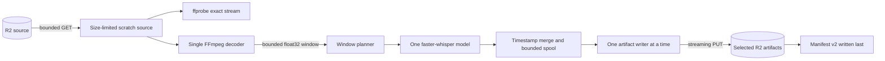

# Bounded-memory transcription design

## 1. Status and scope

- Status: Proposed、Phase 10C local quality gate passed
- Date: 2026-08-10
- Decision: [ADR 0069](./adr/0069-use-bounded-memory-transcription-windows.md)
- Trigger: [8時間full-scan benchmark](./cloud-run-eight-hour-benchmark.md)の16 GiB OOM

本書は最大8時間入力を維持できるか再検証するための設計である。現行RunPod、staging、production、D1、
R2、Cloud Run resourceをまだ変更しない。Cloud Run skillのresource modelに従い、順序とcontextを持つ処理は
複数の独立taskへ分けず、run-to-completion Jobのtask 1件へ限定する。

## 2. Audit findings

現行経路には次の比例allocationとcontract不整合がある。

1. faster-whisper 1.2.1はpathをPyAVで全量decodeし、s16 bufferからfloat32 arrayを作る。
2. VADとfeature extractorも全音声arrayを受けるため、8時間では複数GiBの一時allocationが重なる。
3. Cloud Runのwritable filesystemはmemoryを消費し、size limitなしではcontainerを終了させ得る。
4. `FasterWhisperTranscriber`は全segmentをtupleへ蓄積する。
5. artifact builderはMarkdown、JSON、SRTを同時にbytesとして保持する。
6. jobの`language`、`vad`、`outputFormats`はD1に保存されるがclaim responseに含まれず、workerは常に
   auto language、VAD有効、3形式出力で動く。

6はOOMとは独立した既存不具合である。新しいexecution pathがjob optionsを参照しない状態を受け入れ条件に
含めない。

## 3. Fixed resource and memory boundaries

| Boundary                 | Fixed value                                    |
| ------------------------ | ---------------------------------------------- |
| Provider execution       | 1 attempt = 1 execution = 1 task = 1 GPU       |
| Source duration          | 最大28,800秒                                   |
| Source object            | 最大2 GiB、download後にsize/ETagを再検証       |
| Cloud Run scratch volume | `/tmp`へ専用in-memory volume、size limit 3 GiB |
| Decode output            | 16 kHz、mono、little-endian float32            |
| Core interval            | 900秒                                          |
| Context overlap          | core前30秒、core後30秒                         |
| Maximum inference window | 960秒、61,440,000 bytes、約58.6 MiB            |
| Rolling decode history   | 最大960秒、windowと合わせて約58.6 MiB          |
| Prompt                   | 最大8 KiB UTF-8                                |
| Segment count            | 最大100,000                                    |
| Raw segments per window  | 最大10,000                                     |
| Segment text             | 1件16 KiB、全体64 MiB                          |
| Internal segment spool   | 最大128 MiB、mode 0600                         |
| Internal spool row       | 最大40 KiB                                     |
| Artifact                 | 1形式128 MiB、同時に生成するartifactは1件      |
| FFmpeg processes         | 1                                              |
| Model instances          | 1                                              |
| Cloud execution retry    | 0                                              |

3 GiB scratchは追加memoryではなくcontainerの16 GiBから消費する。source最大2 GiB、spool 128 MiB、current
artifact 128 MiBを同時に保持してもvolume limit内に収める。volume fullはwrite failureとして捕捉し、container
全体のunbounded OOMへ進ませない。実行時peak memoryはCloud Monitoringで別途測定する。

## 4. Data flow



presigned URLは`CapabilityHttpClient`だけが扱う。FFmpeg argv、log、exception、spool metadataへURL、object
key、filename、本文を渡さない。

## 5. Single-pass decoder

ffprobeは最初に採用したaudio streamのindexも`MediaInfo`へ返す。decode commandは固定binaryと引数配列で
構築し、概念上は次の境界だけを許可する。

```text
ffmpeg -nostdin -v error -xerror -i <validated-local-path>
       -map 0:<validated-audio-stream-index>
       -vn -sn -dn -ac 1 -ar 16000 -f f32le pipe:1
```

- 実装ではshellを使わず、stderr本文を利用者応答またはlogへ出さない。
- stdoutはbounded readとbackpressureを使い、次windowを先読みしない。
- ffprobe durationはadmission上限の検査に使うが、arrayをその長さで事前確保しない。decode後のactual sample
  countをartifact durationの正とし、0 sample、float32 frame未満の端数、28,800秒超過を拒否する。
- EOF、non-zero exit、non-frame-aligned output、timeout、cancelをsafe errorへ正規化する。
- cancellationまたは例外時は同じprocessへterminate、bounded wait、必要時killを行い、別processを起動しない。

sourceをwindowごとにseekして再decodeしない。これによりcontainerごとのseek差、先頭からの重複decode、process
増加を避ける。

## 6. Window and merge algorithm

core `i`は`[i * 900, min((i + 1) * 900, duration))`である。通常inference windowは利用可能な範囲でcoreの
前後30秒を含む。decoderは次の通常window開始と直近960秒のうち早い位置までをrolling保持し、残りを解放する。
EOFで最終partial coreが確定した場合だけ、最終windowを`max(0, actual end - 960秒)`まで過去側へ拡張する。
windowとdecode bufferのpeakは引き続き`MAX_WINDOW_BYTES + READ_CHUNK_BYTES`以内であり、8時間全体を保持しない。

各raw segmentについて次を順に検証する。

1. id、start、end、textをPydantic strict schemaで検証する。
2. timestampがfiniteで、`0 <= start <= end`、`start <= window duration`、
   `end <= window duration + 30秒`を確認する。許可したnative end paddingだけをwindow endへclampする。
3. window offsetを加えてglobal timestampへ変換し、全体duration内であることを確認する。
4. raw iteratorを`(midpoint, start, end, raw id)`の非減少順として検証する。先行windowのsegmentを優先し、
   最後に採用したglobal endをmonotonic watermarkとして保持する。後続windowではglobal midpointがwatermarkを
   越えるsegmentだけを採用し、採用後にwatermarkをglobal endの最大値へ進める。
5. windowは順次処理し、採用時に0からglobal idを再発行する。1 windowが10,000件を超えた場合はlazy
   iteratorをそれ以上消費せず失敗する。

text比較によるfuzzy dedupは行わない。本文内容に依存する曖昧な削除を避け、同じacoustic contextを持つ
windowとtimestamp ownershipで重複を制御する。boundary fixtureでduplicate、欠落、逆順を検証する。

`condition_on_previous_text=true`は各windowの内部30秒frame間で維持する。次windowの`initial_prompt`は、
次windowのacoustic context開始より前に終了した採用textだけをwhitespace正規化し、UTF-8末尾からcode
pointを壊さず最大8 KiBに切った値とする。同じ発話をoverlap音声とpromptの両方へ渡さない。promptは
spoolから必要な末尾だけを保持し、logやartifact metadataへ複製しない。
EOFで通常より過去側へ拡張した最終windowには、保持済みpromptとacoustic historyの重複を避けるため
`initial_prompt`を渡さない。検出済みlanguageとVAD設定はそのまま固定する。

## 7. Language, VAD, and execution options

job optionsはjob rowの可変参照ではなく、attempt作成時のimmutable snapshotへ固定する。

```json
{
  "contractVersion": 2,
  "language": "ja",
  "model": "large-v3-turbo",
  "outputFormats": ["markdown", "json", "srt"],
  "vad": true
}
```

- `language=ja`: 全windowへ`language="ja"`を渡す。
- `language=auto`: 最初のwindowだけ`language=None`とし、strict検証した検出言語とprobabilityをattempt結果に
  固定する。後続windowは検出済みlanguageを明示する。
- `vad`: 全windowへexact booleanを渡す。benchmarkはfull scanのためfalse、productはattempt snapshotを使う。
- `outputFormats`: `markdown`、`json`、`srt`の固定順へcanonicalizeし、空、重複、未知値を拒否する。
- `model`: 現時点では`large-v3-turbo`だけを許可し、image内model hashと照合する。

claim/bootstrap responseはこのsnapshotを返し、Workerが別値を選べないようにする。provider ID、URL、tokenと
同様にboundary schemaでstrict検証する。

## 8. Manifest v2 and bounded artifacts

manifest v2は`schemaVersion: 2`、`executionContractVersion: 2`、requested format集合、存在するartifactだけを
含む。Orchestratorはattempt snapshotとの集合完全一致に加え、各keyのjob ID、attempt ID、format拡張子、
size、SHA-256を確認する。余分、不足、別attempt key、format/key不一致、v1 fallbackは拒否する。execution
contractのversionとresult manifest schemaのversionを同じfieldへ過積載しない。capability URLはcontractで
credentialなしHTTPS構文を要求し、HTTP adapterでpurpose別exact hostとpublic DNSをさらに検証する。

segmentはinternal JSON Lines spoolへ逐次書く。各rowはglobal id/start/end/textだけを持ち、任意metadataを
許可しない。spoolとartifactはtask固有directory内のregular file、mode 0600、symlink拒否、exclusive create
を必須とする。

選択形式ごとに次を行う。

1. spoolを先頭からbounded readする。
2. 一つのartifact fileへincremental encodeし、同時にbyte countとSHA-256を計算する。
3. hard limitとexpected regular fileを再検証する。
4. exact capabilityへknown content length付きでstreaming PUTする。
5. upload成功後にそのartifact fileを削除する。

全選択artifact成功後だけsmall manifestをmemoryで作り、最後にPUTする。partial upload、process crash、cancelでは
manifestを書かず、current attemptを完了扱いにしない。

## 9. Failure, cancellation, and idempotency

| Failure                               | Required behavior                                                              |
| ------------------------------------- | ------------------------------------------------------------------------------ |
| source/volume limit                   | inference前またはbounded writeで失敗し、manifestなし                           |
| FFmpeg non-zero/invalid frame         | processを回収し`INVALID_MEDIA`へ正規化                                         |
| window schema/timestamp drift         | `TRANSCRIPTION_FAILED`、raw native値をlogしない                                |
| segment/text/spool/artifact limit     | fail closed、上限を増やしてsame attemptをretryしない                           |
| heartbeat cancel                      | decoder/model safe pointで停止し`CANCELLED`、scratch cleanup                   |
| artifact PUT response loss            | 同じexecution内で盲目的に再PUTせずfailureへ収束し、manifestなし                |
| manifest PUT response loss            | current behaviorと同じ結果不明としてOrchestratorがexact objectをreconcile      |
| process/container crash               | attemptは完了しない。provider cleanup後、利用者retryだけがnew generationを作る |
| duplicate/out-of-order provider event | attempt、contract version、winner、manifest、artifact集合のCASで拒否           |

chunk単位の外部checkpointやpartial manifestは初期実装へ追加しない。秘密本文の保持箇所、cleanup state、winner
競合が増えるためである。1 executionが時間上限へ収まらない証拠が得られた場合だけ別ADRで検討する。

## 10. Offline implementation gates

product serviceへ接続する前に、isolated moduleとbenchmark entrypointで次を満たす。

- planner: 1秒、900秒境界、901秒、8時間、最終partial core、sample端数
- decoder: exact stream、multi-stream、corrupt input、zero/over-limit/non-frame output、timeout、cancel、cleanup
- merge: boundary跨ぎ、30秒overlap、monotonic watermark、segmentation drift、逆順、重複、範囲外、
  NaN/Infinity、global ID
- prompt: 8 KiB、multi-byte UTF-8、空text、本文のlog不在
- options: ja/auto、VAD true/false、1～3 output formats、snapshot drift、contract v1/v2混同拒否
- limits: segment数、per-text、total text、spool、artifact、volume full
- artifacts: 選択形式だけ、incremental hash/size、partial PUT、manifest-last、symlink/foreign path拒否
- recovery: cancel、FFmpeg/model exception、artifact response loss、finally cleanup
- security: URL、token、filename、本文、raw exceptionがstdout/stderr/test artifactへ出ない

標準Ruff、mypy strict、pytest、container offline check、root `pnpm check`、dependency audit、Gitleaks、Trivyを
すべて成功させる。buffer sizeとscratch sizeはtestから参照するproduction constantに固定し、testだけの小さい
値で本番上限の算術を迂回しない。

Phase 10Aのisolated実装は次で構成する。

- `bounded_decoder.py`: exact streamを一つのFFmpeg processでdecodeし、actual EOF sample数から最大32 windowを
  動的に確定する。8時間float32全体を事前確保しない。
- `bounded_transcription.py`: pure planner、monotonic overlap watermark、8 KiB prompt、mode 0600 JSON Lines spool。
- `bounded_inference.py`: model instance一つ、逐次window、ja/auto一度固定、exact VAD。
- `bounded_artifacts.py`: 選択形式だけを一件ずつfile-backed生成し、hash/size付きでuploadしてmanifest v2を最後に
  書く。
- `bounded_contracts.py`と`packages/contracts/src/bounded-execution.ts`: 同じfixtureを読むstrict v2 contract。
- `bounded_container_check.py`: production定数の8時間virtual PCM、32 window、空segment spool、3形式artifact、
  cleanupをnetworkなしのbuild済みimage内で検証する。
- `cloud_run_bounded_gpu_benchmark.py`: 同じcoreへ実FFmpeg、NumPy zero-copy view、faster-whisper model一つを
  接続するisolated Phase 10B entrypoint。R2、実録音、product stateは使用しない。

2026-08-10のPhase 10A local gateではPython 199件、coverage 91.27%、root `pnpm check`、Node High以上と
Python dependency audit、Git履歴/worktree Gitleaks、変更後image build、通常offline check、8時間bounded
container check、Trivy High/Critical scanが成功した。通常CIとrelease candidate publishも同じ8時間image
checkを必須にした。Node Moderate 1件は既存findingとして明示し、High gateの成功に隠していない。

この時点で現行`service.py`、claim HTTP、D1 migration、staging/production runtimeには接続しない。既存job
options不整合を直すproduct migrationはPhase 11以降で同一contractを使って実装する。

## 11. One bounded Cloud Run re-probe

offline gate後に[bounded Cloud Run re-probe review packet](./cloud-run-bounded-eight-hour-reprobe.md)を提示し、
別の明示承認がある場合だけ再実行する。

| Boundary  | Fixed value                                                                      |
| --------- | -------------------------------------------------------------------------------- |
| Job       | isolated Cloud Run Job、public serviceなし                                       |
| Compute   | L4 x 1、4 vCPU、16 GiB、task/parallelism 1、retry 0、timeout 55分                |
| Scratch   | size-limited in-memory volume 3 GiB                                              |
| Input     | 8時間synthetic PCM、VAD false、実録音なし                                        |
| Execution | exact 1、unknown response時はread-backのみ、再送なし                             |
| Evidence  | terminal marker、execution count、billable time、memory/tmpfs/GPU memory metrics |
| Cleanup   | Job/execution、repository/image、service accountを削除し残存0                    |

採用候補条件は、success、application marker 1、failure 0、billable time 30分以下、peak container memory 12 GiB
以下、tmpfs 3 GiB未満、OOM 0、resource残存0である。30～45分またはmemory 12 GiB超はInconclusive、45分超、
timeout、OOM、native failureはRejectとする。synthetic成功後も非機密speech-like fixtureによるboundary品質、
日本語、auto language、選択formatのstaging acceptanceが必要である。

## 12. Rejected alternatives

- **16 GiBから32 GiBへ増やして同じ8時間一括処理をretry**: 入力比例allocationを残し、ADR 0068のOOM時
  stop ruleにも反する。
- **Cloud Run taskを32個並列化**: taskは独立であり、language/prompt、single winner、manifest、cancel、
  capability、partial failureの分散coordinationが先に必要になる。
- **15分ごとにsourceをseekしてFFmpegを再起動**: container/codecごとのseek差と重複decode、process増加を
  招く。
- **text fuzzy matchingでoverlap dedup**: 言語と本文内容に依存して正しい反復発話を削除し得る。
- **chunk transcriptをR2へcheckpoint**: sensitive object、cleanup、version、winner stateを増やす。初期の
  1時間以内one-shot成立を確認する前には採らない。
- **最大時間を直ちに短縮**: fallbackとして残すが、bounded設計を一度offline評価するまでは8時間要件を
  変更しない。

## 13. Plan review result

| Severity | Finding                                                                     | Resolution                                                                                       |
| -------- | --------------------------------------------------------------------------- | ------------------------------------------------------------------------------------------------ |
| Blocker  | 8時間入力をpathのままfaster-whisperへ渡すと入力時間比例のmemoryを使う       | single-pass decoderと最大16分windowへ制限し、同じ経路のmemory増量retryを禁止する                 |
| Blocker  | job optionsがclaimへ渡らず、利用者のlanguage、VAD、formatと実行が一致しない | immutable execution contract v2とmanifest v2をPhase 11のmigration、capability、completionへ通す  |
| Blocker  | Phase 12以降が停止済みのRunPod Podsを採用済みとしていた                     | 採用ADRまでprovider固有実装をBlockedにし、selected-provider control plane/runtimeへ一般化した    |
| High     | source、segment、3 artifactを同時に保持すると別のmemory amplificationが残る | 3 GiB scratch、128 MiB spool、1 artifactずつのstreaming uploadとhard limitを固定した             |
| High     | window境界で重複、欠落、言語driftが起こり得る                               | 30秒context、monotonic watermark、bounded prompt、auto language一度固定をfixtureでacceptanceする |
| High     | 複数Cloud Run taskは順序、winner、manifest、cancelを分散させる              | 初期実装は1 attempt、1 execution、1 taskに固定し、chunk checkpointと並列taskを採用しない         |

このreviewに従うPhase 10Aのisolated code、contract、全local gateは完了したが、product code、migration、
cloud resource、staging、productionには接続していない。Phase 10Bは別review packetの確認と明示承認が揃うまで
開始しない。

## 14. References

- [ADR 0068](./adr/0068-benchmark-cloud-run-eight-hour-input.md)
- [ADR 0069](./adr/0069-use-bounded-memory-transcription-windows.md)
- [Bounded Cloud Run 8-hour re-probe](./cloud-run-bounded-eight-hour-reprobe.md)
- [Cloud Run container runtime contract](https://docs.cloud.google.com/run/docs/container-contract)
- [Cloud Run Jobs in-memory volume](https://docs.cloud.google.com/run/docs/configuring/jobs/in-memory-volume-mounts)
- [Cloud Run Jobs](https://cloud.google.com/run/docs/create-jobs)
- [Cloud Run metrics](https://docs.cloud.google.com/monitoring/api/metrics_gcp_p_z)
- [faster-whisper 1.2.1 transcribe](https://github.com/SYSTRAN/faster-whisper/blob/v1.2.1/faster_whisper/transcribe.py)
- [faster-whisper 1.2.1 audio decode](https://github.com/SYSTRAN/faster-whisper/blob/v1.2.1/faster_whisper/audio.py)
