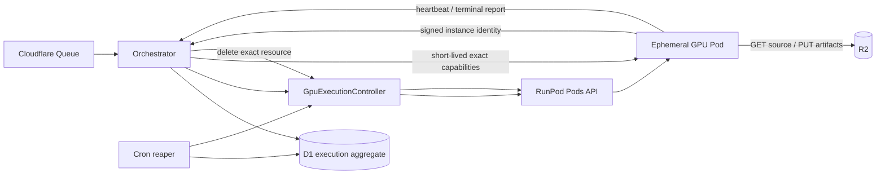

# 一時GPU Pod実行設計

## 1. Status and scope

本書は[ADR 0066](./adr/0066-design-ephemeral-gpu-vm-execution.md)のProposed設計を保存する、停止中の
RunPod Pods比較案である。Phase 12以降のactive implementation sourceではない。
RunPod Serverlessのcapacity保証と公開APIの待機理由分類がScribeDropの要求に適合しないことは
[ADR 0065](./adr/0065-validate-runpod-serverless-gpu-pools.md)で確認済みであり、Phase 8の
[provider decision packet](./ephemeral-gpu-vm-provider-decision.md)では当初RunPod Podsを第一候補とした。
ただしpublic IP、create冪等性、署名付きinstance identity、provider側hard lifetimeのmandatory gapは
未解決である。[ADR 0067](./adr/0067-evaluate-cloud-run-gpu-jobs.md)はRunPod Podsのactive probeを停止し、
Cloud Run GPU Jobの隔離評価へ変更した。Cloud Runのproduct採用も未決定であり、active pathはADR 0067、
[ADR 0068](./adr/0068-benchmark-cloud-run-eight-hour-input.md)、
[ADR 0069](./adr/0069-use-bounded-memory-transcription-windows.md)を正とする。現行の`docs/spec.md`、
`docs/additional-spec.md`、staging、productionを変更しない。

採用する場合のtarget releaseは`0.2.0`とする。`0.1.1`は現行RunPod構成の修正だけを対象とし、
本方式のcode、migration、cloud resource、credential、workflowを混在させない。root packageの
versionは設計またはprobe時に変更せず、全product Phaseを`develop`へ統合した後に
`release/0.2.0`で更新する。

目的は、文字起こしattemptごとにGPU Podを最大1台だけ作成し、provider署名付きidentityと
control-plane read-backを検証してから録音へアクセスさせ、処理後にresourceを確実に削除する
実行方式を定義することである。

非目標は次のとおりである。

- この設計だけでproviderを採用すること
- GPU shortageを存在しないものとして扱うこと
- 常時起動pool、Kubernetes、複数provider同時実行を初期導入すること
- 外部生成AI APIへ録音または文字起こし本文を送ること
- UIへprovider選択を露出すること

## 2. 維持するsecurity invariant

providerを変更しても次を緩めない。

- 外部GPUへ最初に渡す情報へR2 URL、R2 key、filename、title、email、本文を含めない。
- 実Workerのidentity、image、GPU、network、lifecycleを検証するまでR2 capabilityを発行しない。
- capabilityはexact object、exact method、短いexpiryに限定する。
- claimまたはbootstrap前にmodel load、source download、ffprobe、GPU inferenceを開始しない。
- model、CUDA、FFmpeg、Python依存、base image、container imageをimmutableに固定する。
- runtime package install、model download、任意URL、redirect、private/metadata destinationを拒否する。
- manifestは最後に書き、terminal report、manifest、全artifact、current attemptを揃える。
- Queue、create、bootstrap、heartbeat、complete、cancel、delete、Cronを冪等にする。
- raw provider response、resource ID、identity evidence、token、URL、本文をlogへ残さない。
- staging acceptanceなしにproduction providerを変更しない。

一時Pod方式では次を追加する。

- public IPとinbound network ruleを持たない。
- SSH key、password、対話login、serial consoleを通常運用で有効化しない。
- Network Volumeとpersistent volumeを付けず、container diskはPod terminate時に削除する。
- PodへRunPod API credentialやstorage列挙権限を与えない。
- Orchestratorの正常完了は、exact Podとpersistent storageの削除または不存在確認を必須とする。
- provider側のhard lifetimeを必須とし、application cleanup停止時も自動削除する。

## 3. Component boundary



### Orchestrator

- job/attemptの正、provider execution lease、winner CAS、capability、finalizeを管理する。
- providerごとの差を`GpuExecutionProvider` portの外へ漏らさない。
- provider raw errorを`capacity_unavailable`、`request_rejected`、`outcome_unknown`、
  `identity_invalid`、`resource_drift`、`cleanup_unknown`へ分類する。

### GpuExecutionController

- RunPod Pods APIを型付きHTTP client越しに呼ぶ小さなcontrol-plane境界とする。Orchestrator内adapterか
  分離serviceかはcredential scopeの確認後にPhase 12で決める。
- 固定policyからcreate/get/terminateだけを行い、RunPod credentialをPodへ渡さない。
- callerがmachine type、image、command、environment、network、storage、data centerを
  指定できないようにする。requestは`policyId`とopaque execution handleだけを受け付ける。
- timestamp、nonce、body digestを含む認証済みrequestを検証し、replayを拒否する。
- application data、R2 capability、claim token、job ID、attempt IDを受け取らない。
- provider operationとresourceをbounded schemaへ変換し、raw bodyを返さない。
- create/terminate request内でPod起動または削除完了を待たない。provider mutationのboundedな受理結果、
  operation reference、既知のexact resourceだけを返し、OrchestratorのQueue/Cron reconciliationが
  deadlineまでread-backする。Cloudflare request timeoutをprovisioning timeoutとして扱わない。

RunPod API credentialのscopeがaccount全体へ及ぶ場合は、Cloudflareへ直接置く前に分離controller、
credential rotation、rate limit、environment分離、budget guardを脅威分析する。最小scopeをproviderが
提供しない場合は、その残余riskを別ADRで承認するまでproduct採用しない。

### Ephemeral GPU Pod

- build時に検証済みWhisper runtimeとmodelを含むimmutable container imageから作る。
- startup dataには単独で権限を持たないopaque execution handleだけを含める。
- RunPodが提供する場合はprovider署名付きidentity evidenceを取得し、outbound HTTPSで
  Orchestratorへbootstrapする。
- 処理完了後にartifactとmanifestを残し、terminal reportを冪等送信する。
- 自身へPod create/terminate権限を持たせない。削除は外部controllerとhard lifetimeが行う。

現行Python Workerのmedia検証、transcription、artifact、manifest、cleanupをprovider-neutralな
one-shot task runnerとして維持する。RunPod Serverless SDK handlerは既存adapterとして残し、Pod entrypointは
instance identity、bootstrap、heartbeat、terminal reportだけを追加する。provider変更を理由に
Whisper処理を再実装しない。

## 4. Provider-neutral ports

将来のinterfaceは少なくとも次を分離する。型名は実装時に`packages/domain`と
`packages/contracts`で確定し、provider SDK型を公開型にしない。

```text
GpuExecutionProvider
  create(fixedPolicyId, executionHandle, idempotencyKey)
  read(executionRef)
  delete(executionRef, idempotencyKey)
  verifyIdentity(identityEvidence, expectedExecution)

ExecutionRepository
  acquireCreateLease(attemptId, version)
  recordCreateAccepted(...)
  recordCreateUnknown(...)
  recordObservedResource(...)
  claimAttestedExecution(...)
  recordTerminalReport(...)
  requestCleanup(...)
  recordCleanupComplete(...)
```

`create`と`delete`のHTTP timeoutは結果不明である。mutationを別resource nameまたは別keyで再送せず、
同じidempotency key、決定的resource name、read/list operationから収束させる。

## 5. Control protocol

### Create request

概念上のrequestは次の情報だけを含む。

```json
{
  "schemaVersion": 1,
  "environment": "staging",
  "policyId": "reviewed-policy-digest",
  "executionHandle": "opaque-random-handle",
  "idempotencyKey": "opaque-idempotency-key",
  "provisioningDeadline": "UTC timestamp"
}
```

controllerは固定policyから次を解決する。

- RunPod accountとenvironment
- data center候補
- GPU SKUと個数
- immutable container image digest
- `cloudType: SECURE`
- empty ports、global networking無効、SSH/Jupyter/proxy無効
- Network Volumeとpersistent volumeなし
- hard maximum runtimeとterminate action
- environment、candidate、policyを表す非機密label

任意field、自由入力metadata、startup script、container commandをrequestで上書きできないようにする。

### Bootstrap request

Podは最初にopaque execution handle、random bootstrap request ID、一時HPKE public keyを
Orchestratorのchallenge endpointへ送り、短命かつ未使用のnonceとidentity audienceを
受け取る。audienceまたはnonceはexecution handle、request ID、public key digestに結び
付ける。challenge responseはR2 capability、job ID、attempt IDを含まず、取得だけでは
処理を開始できない。PodはRunPodが提供する場合にidentity endpointへそのaudienceまたはnonceを渡して
identity evidenceを取得し、次を送る。

```json
{
  "schemaVersion": 1,
  "executionHandle": "opaque-random-handle",
  "bootstrapRequestId": "opaque-random-request-id",
  "nonce": "single-use-server-challenge",
  "ephemeralPublicKey": "bounded-encoded-public-key",
  "identityEvidence": "provider-signed-bounded-document"
}
```

identity evidenceは最大size、encoding、algorithm、issuer、audience/nonce、`iat`、`exp`をstrictに
検証する。Podが任意のnonceを自己申告するだけでは足りず、D1に保存した未使用challengeと一致し、
一度だけ消費できることを必須とする。同じrequest ID、public key、evidence digestの再送だけは
後述の同一暗号化responseへ収束させ、いずれかが異なる再利用は拒否する。providerが任意nonceまたは
audienceを署名対象にできない場合は、signed evidenceの作成時刻、live resource creation time、
未使用challenge、execution handleを併用し、replay耐性を隔離probeで実証できなければ移行を
Blockedのままとする。

署名検証後にprovider APIからexact resourceを読み、次を照合する。

- provider、account、data center
- Pod ID、machine ID、決定的name、creation timestamp
- RUNNING state
- immutable container image digestとcandidate policy
- GPU SKU、GPU count、machine
- Secure Cloud、empty ports、global networking無効
- Network Volumeとpersistent volumeなし
- hard lifetime、termination action
- environment、execution、policy label

不一致時はbootstrapを拒否し、R2 capabilityを発行せず、exact Podをcleanup対象にする。

### Granted session

bootstrap成功後だけ、Orchestratorはcurrent attemptをCASでwinnerにし、現行claim responseと同じ
job ID、attempt ID、schema version、exact R2 capability、heartbeat URL、短期session tokenを含む
grantを作る。grantはPodの一時public keyへHPKE暗号化し、request IDとcontextに結び付ける。

D1にsession token hashと短命の暗号化grant capsuleだけを保存する。raw tokenや署名付きURLを
保存しない。response喪失時は、同じrequest ID、public key、evidence digestのみが同一capsuleを
受け取れる。これによりchallengeの一回性を緩めず、Podまたはattemptを余分に作らない。
Podは復号後にsession tokenでgrantをackし、capsuleはackまたはexpiryで削除する。HPKE suite、
key validation、context binding、expiryはcontractに固定し、identity evidence、capsule、provider resource IDを
application logへ渡さない。

### Terminal report

Workerはmanifest PUT後に、本文を含まないterminal reportをsession tokenで送る。response loss時は
同じexecution、同じterminal valueを冪等に再送できる。異なるterminal valueはconflictとする。

## 6. State and persistence

公開job/attempt statusは現行のまま維持する。provider resource lifecycleを同じstatusへ詰め込まず、
新しい`provider_executions` aggregateで管理する。

```text
execution status:
  CREATE_PENDING
    -> CREATE_UNKNOWN -> reconcile same resource
    -> PROVISIONING
    -> BOOTSTRAP_CHALLENGED
    -> ATTESTED
    -> GRANT_PENDING
    -> RUNNING
    -> SUCCEEDED | FAILED | CANCELLED

cleanup status (orthogonal):
  NOT_REQUESTED -> PENDING -> DELETING -> COMPLETE
                                 └──────> UNKNOWN -> reconcile
```

想定する主なfieldは次である。実装時は新migrationでschema、CHECK、indexを決める。

- internal execution ULID、attempt ID、provider kind、environment
- opaque execution handleのhash
- idempotency keyまたはhash、決定的resource name
- provider Pod/storage resource ID、operation ID
- fixed policy ID、candidate ID、expected image ID、expected GPU policy
- execution status、cleanup status、version
- create lease、provisioning deadline、bootstrap deadline、hard delete deadline
- bootstrap request ID、一時public key digest、identity evidence digest、challenge status/expiry
- 短命の暗号化grant capsule、capsule expiry、grant ack time
- observed creation time、running time、heartbeat time、terminal time、deleted time
- safe error classification、retry count、next reconciliation time

provider resource IDはcapabilityではないがlogへ出さない。D1ではexact read/deleteのために保持し、
job削除時もresource不存在を確認するまで消さない。

### Forward-only migration

1. `provider_executions`とprovider-neutral foreign keyをexpand migrationで追加する。
2. 現行RunPod adapterを同じportへ包み、stagingでdual-writeする。
3. completion、cancel、delete、retentionをprovider-neutral readerへ切り替える。
4. ephemeral Pod adapterをstagingだけで有効化する。
5. production acceptance後にproviderをenvironment固定設定で切り替える。
6. RunPod固有列とtableは少なくとも1 release保持し、後続のtable rebuild migrationで除去する。

同じattemptをRunPod ServerlessとRunPod Podへ同時投入しない。provider kindとpolicyはattempt作成時に固定し、retryは
新generation、新attempt、新executionを作る。

## 7. Completion and cleanup

一時Pod方式では次をすべて満たした場合だけ`COMPLETED`へCASする。

1. current job、generation、attempt、provider executionが一致する。
2. attested executionだけがwinnerである。
3. allowlist済みterminal report `SUCCEEDED`をD1へ保存済みである。
4. complete manifestと全artifactが存在し、identity、key、size、hashが一致する。
5. heartbeat/session capabilityを失効済みである。
6. exact Podとpersistent storageが削除済み、またはproviderがexact resourceの不存在を返す。
7. cleanup CASとnotification outbox作成が成功する。

Worker自身のshutdown、providerのSTOPPED、controllerのdelete受理だけでは6を満たさない。
delete outcomeが不明ならjobを成功確定せず、Cronが同じresourceをreconcileする。hard lifetimeは
最後の防衛であり、application read-backの代替にしない。

## 8. Failure recovery

| Failure                           | Required behavior                                                                   |
| --------------------------------- | ----------------------------------------------------------------------------------- |
| create timeout                    | `CREATE_UNKNOWN`。同じexecutionをreadし、別Podを作らない                            |
| explicit capacity rejection       | capabilityを発行せずattemptを安全にFAILED。自動で別providerへ送らない               |
| RUNNING前に8分超過                | exact createをcancel/deleteし、10分開始SLO内でFAILEDへ収束                          |
| bootstrapなし                     | capability未発行のままdelete。image/startup/identity failureを安全なcodeへ分類      |
| identityまたはresource drift      | claim拒否、security alert、exact Pod terminate                                      |
| bootstrap response loss           | exact requestに同一HPKE capsuleを再送し、別Pod・別key・別attemptを作らない          |
| heartbeat stale                   | capability失効、cancel要求、grace後にforce delete                                   |
| Spot/preemption                   | 初期はSpotを使わない。将来は新attemptとしてのみ再実行                               |
| terminal report後のdelete timeout | manifestを保持し、`cleanup=UNKNOWN`でreconcile。COMPLETEDにしない                   |
| controller停止                    | provider hard lifetimeがdeleteし、復旧後に不存在をread-back                         |
| user delete                       | jobを非表示化し、capability失効、exact Pod terminate、R2 cleanup、最後にD1親row削除 |
| duplicate/out-of-order callback   | expected status、version、execution IDのCASで拒否                                   |

## 9. Network and identity

- 現行invariantではPodにpublic IPv4/IPv6を付けず、inboundを許可しない。RunPod Secure Cloudが
  public IP必須であるため、無効化またはnetwork layerで同等以上の全inbound拒否を確認できるまでBlockedとする。
- outboundはOrchestratorとR2のexact originだけを許可する。RunPodでprovider-native egress制限を
  実現できない場合はegress proxyを含む代替controlを別ADRでreviewする。
- DNS解決後IP、TLS、redirect、host、portをWorkerコードでも再検証する。
- provider metadata endpointはidentity取得専用adapterからだけ利用する。取得したdocumentをlogへ
  出さず、bounded memoryで扱う。
- RunPod Podsで利用できるprovider署名付きidentityは公開仕様で確認できない。support回答で存在を
  確認できた場合も、issuer、audience/nonce、Pod ID、machine ID、作成時刻を検証し、live resource
  read-backを省略しない。存在しない場合は、代替controlを別ADRと脅威testでreviewするまで録音への
  capabilityを発行しない。
- PodへRunPod API credentialを渡さない。private registry pullはRunPod側の既存registry credentialを
  使い、値をPod環境変数へ展開しない。runtimeとmodelはcontainer imageへ内包する。

## 10. Cost and availability guardrails

- 全environment合計の初期max concurrent GPU Podは1とする。
- create rateと日次上限をD1、controller、RunPod account read-backの3層で制限する。
- hard runtimeは実8時間media benchmarkとcleanup余裕から決め、根拠なしに現行6時間を引き継がない。
- Podは成功・失敗・cancel後にstopではなくterminateする。volume、Network Volumeを残さない。
- provider spend limitはaccount全体の制御としてだけ使う。controllerはactive Podの最大残存時間と完了済み
  metered timeから保守的な予約費用を計算し、独立したhard ceiling超過時に新規createを拒否する。
- 初期はOn-Demandを使う。Spot/interruptible、Savings Planは別ADRとfault testを
  必須とする。
- GPU名ではなく、VRAM、CUDA compatibility、real-time factor、boot time、単価、data center availabilityで
  選ぶ。consumer GPUの5090/4090だけを採用条件にしない。

開始SLOは現行どおり、create受理からattested bootstrapまで10分未満とする。staging prewarmは
8分で停止し、実jobを作成しない。処理SLOとhard runtimeは最大入力benchmark後に確定する。

## 11. Provider capability gate

RunPod Podsは既存account、container image、GPU catalogを再利用でき、Podの作成・一覧・削除と
秒単位課金が公式に提供されるため比較対象へ含める。一方、2026-08-10時点の公開仕様では次のgapが
ある。

- Secure Cloud Podは常にpublic IPを持つと明記され、現行のno-public-IP invariantを満たさない。
- create requestのidempotency token、Pod内から検証できるprovider署名付きinstance identity、短い
  hard lifetimeによる自動deleteは確認できない。
- explicit terminateとmachine/GPU/Secure Cloud read-backは提供されるが、application cleanup停止時の
  第3回収境界にはならない。

ADR 0066策定時はRunPod PodsをPhase 8以降の第一候補とした。既存account、container、GPU catalogを
再利用できる利点はあるが、mandatory gapを解消できず、ADR 0067によりこの評価経路は停止している。
以下のcapability表とGate C以降は、RunPod Podsを将来再評価する場合の未解決条件としてだけ保持し、
現行Phase 12以降の実装条件には使わない。

| Capability                                   | Mandatory | RunPod Pods status                                     |
| -------------------------------------------- | --------- | ------------------------------------------------------ |
| idempotent create key                        | yes       | 公開仕様で未確認。support回答待ち                      |
| exact resource read/delete                   | yes       | API提供あり。隔離probeで整合性を確認                   |
| signed instance identity                     | yes       | 公開仕様で未確認。support回答待ち                      |
| immutable image exact read-back              | yes       | digest create/read-backを隔離probeで確認               |
| GPU SKU/count/Secure Cloud exact read-back   | yes       | API fieldあり。隔離probeで確認                         |
| no-public-IP outbound-only                   | yes       | Secure Cloudはpublic IP必須。全inbound拒否保証を確認中 |
| per-Pod short hard lifetime with auto-delete | yes       | 公開仕様で未確認。support回答待ち                      |
| create/delete audit operation                | yes       | system logとAPI read-backを隔離probeで確認             |
| capacity failure is explicit                 | yes       | Pod createのerror分類とresponse lossを隔離probeで確認  |
| billing termination is observable            | yes       | 秒単位課金。terminate後のBilling停止を隔離probeで確認  |

参照する一次資料:

- [RunPod: Pod作成API](https://docs.runpod.io/api-reference/pods/POST/pods)
- [RunPod: Pod管理とterminate](https://docs.runpod.io/pods/manage-pods)
- [RunPod: Pod料金](https://docs.runpod.io/pods/pricing)

## 12. Staged validation plan

### Gate A: offline design and contracts

- provider port、state machine、strict schemas、safe error codesをfakeで検証する。
- duplicate create、timeout after effect、stale execution、concurrent cleanup、terminal conflictを注入する。
- provider SDKやCLIをapplication runtimeからsubprocess実行しない。
- probe前にRunPod Podsのdata処理境界、全resource、credential配置、capacity、data center、GPU SKU、
  hard lifetime、cleanup、最大費用を一つのreview packetへ固定する。

### Gate B: RunPod Pods control-plane probe

- 利用者承認後に既存RunPod accountでSecure Cloud GPU Podを1台だけ作る。
- idempotent create、identity evidence、inbound拒否、fixed image、hard auto-delete、explicit terminate、
  orphan reaper、課金停止を確認する。未解決gapがあればcreate前に停止する。
- recording、R2 capability、production/staging credentialを使わず、固定synthetic inputだけを使う。
- probe harnessはproduct runtimeから隔離し、resource名、idempotency、cleanup対象を固定する。これは
  feasibility testであり、ADR Accepted前のapplication、D1 schema、staging変更を許可しない。

### Gate C: isolated GPU probe

- 合成mediaだけを使い、1 GPU、max concurrency 1、短いhard lifetimeで実施する。
- boot time、GPU/driver/model、offline container、real-time factor、最大VRAM、artifact、cleanup、
  provider operation logを測定する。
- 失敗後はPod、persistent storage、公開port、operation中resourceが0であることを独立確認する。
- 最大8時間入力を維持する場合は、release前に最大入力の処理時間、capability更新、hard lifetime、
  費用を実測する。実測しない場合は別ADRとspec変更でadmission上限を下げる。
- Cloud Run L4 16 GiBの一括full-scanはmemory limitで失敗したため、provider変更だけで解決済みとしない。
  次のprobe前に[ADR 0069](./adr/0069-use-bounded-memory-transcription-windows.md)のbounded-memory分割を
  offlineで成立させ、同じ最大入力を固定memory ceilingで検証する。

Gate C成功後にprovider選定ADRを作り、ADR 0066をAcceptedへ変更してからproduct migrationへ進む。

### Gate D: staging shadow path

- UIから到達不能なstaging専用経路で、provider-neutral execution aggregateを検証する。
- RunPodと同じattemptを二重実行せず、synthetic fixtureだけを使う。

### Gate E: formal staging acceptance

- 正常M4A、破損M4A、失敗通知、cancel、timeout、worker crash、controller response loss、terminate response
  lossを検証する。
- exact candidate、signed identity、manifest、全artifact、Pod/storage不存在、通知、fixture cleanupを一つの
  短命acceptanceへ結び付ける。

### Gate F: production migration

- staging acceptanceをproduction workflowが再検証する。
- providerはenvironment固定設定で切り替え、UIやjob単位の自由選択を許さない。
- RunPod Serverless adapterはrollback期間だけ保持し、自動fallbackには使用しない。
- production read-backと最初のsynthetic smoke成功後もmax concurrency 1を維持する。
- rollbackは先に新規Pod投入を停止し、active execution、Pod、storage、operationが0になるまで新codeの
  reaperを維持する。RunPod Serverlessへ自動fallbackせず、PodsもServerlessも安全に使えない場合はjobを
  `SUBMISSION_PENDING`に保つ。旧codeへのrollbackはprovider resource不存在確認後だけ許可する。

## 13. Open questions

- RunPod Podsの候補GPUごとに、作成からterminate確認までの実課金はいくらか。
- RunPod Podsのpublic IPを無効化できるか、または空portsで全inboundをnetwork layerから拒否できるか。
- create冪等key、署名付きinstance identity、provider側hard lifetimeをRunPodが提供するか。
- one-shot process終了後のrestartを無効化し、Pod状態と課金継続を一意に判定できるか。
- bounded-memory分割後の最大8時間mediaのboot込み処理時間、peak memory、VRAM、費用上限はいくらか。
- 既存worker image digestをPod APIで指定し、同一digestとしてread-backできるか。
- CloudflareからRunPod Pod controllerへ、長期account-wide API keyの影響を最小化してどう認証するか。
- egressをexact hostnameへ制限できるprovider-native構成とproxyの運用負荷はどれくらいか。
- terminal report後のPod terminate確認を含む利用者待ち時間が許容範囲か。

これらをprobe前に推測で確定しない。
