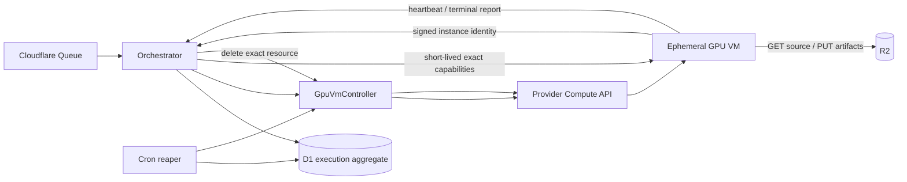

# 一時GPU VM実行設計

## 1. Status and scope

本書は[ADR 0066](./adr/0066-design-ephemeral-gpu-vm-execution.md)のProposed設計である。
RunPod Serverlessの保証がScribeDropの要求に適合しない場合に備えたexit designであり、現行の
`docs/spec.md`、`docs/additional-spec.md`、staging、productionを変更しない。

採用する場合のtarget releaseは`0.2.0`とする。`0.1.1`は現行RunPod構成の修正だけを対象とし、
本方式のcode、migration、cloud resource、credential、workflowを混在させない。root packageの
versionは設計またはprobe時に変更せず、全product Phaseを`develop`へ統合した後に
`release/0.2.0`で更新する。

目的は、文字起こしattemptごとにGPU VMを最大1台だけ作成し、provider署名付きidentityと
control-plane read-backを検証してから録音へアクセスさせ、処理後にresourceを確実に削除する
実行方式を定義することである。

非目標は次のとおりである。

- この設計だけでproviderを採用すること
- GPU shortageを存在しないものとして扱うこと
- 常時起動pool、Kubernetes、複数provider同時実行を初期導入すること
- 外部生成AI APIへ録音または文字起こし本文を送ること
- UIへprovider選択を露出すること

## 2. 維持するsecurity invariant

providerを変更しても次を緩めない。

- 外部GPUへ最初に渡す情報へR2 URL、R2 key、filename、title、email、本文を含めない。
- 実Workerのidentity、image、GPU、network、lifecycleを検証するまでR2 capabilityを発行しない。
- capabilityはexact object、exact method、短いexpiryに限定する。
- claimまたはbootstrap前にmodel load、source download、ffprobe、GPU inferenceを開始しない。
- model、CUDA、FFmpeg、Python依存、base image、boot imageをimmutableに固定する。
- runtime package install、model download、任意URL、redirect、private/metadata destinationを拒否する。
- manifestは最後に書き、terminal report、manifest、全artifact、current attemptを揃える。
- Queue、create、bootstrap、heartbeat、complete、cancel、delete、Cronを冪等にする。
- raw provider response、resource ID、identity evidence、token、URL、本文をlogへ残さない。
- staging acceptanceなしにproduction providerを変更しない。

VM方式では次を追加する。

- public IPとinbound network ruleを持たない。
- SSH key、password、対話login、serial consoleを通常運用で有効化しない。
- boot disk以外の永続diskを付けず、boot diskもVM削除時に自動削除する。
- VMのcloud identityへcompute create/delete権限やstorage列挙権限を与えない。
- Orchestratorの正常完了は、exact VMの削除または不存在確認を必須とする。
- provider側のhard lifetimeを必須とし、application cleanup停止時も自動削除する。

## 3. Component boundary



### Orchestrator

- job/attemptの正、provider execution lease、winner CAS、capability、finalizeを管理する。
- providerごとの差を`GpuExecutionProvider` portの外へ漏らさない。
- provider raw errorを`capacity_unavailable`、`request_rejected`、`outcome_unknown`、
  `identity_invalid`、`resource_drift`、`cleanup_unknown`へ分類する。

### GpuVmController

- providerと同じcloud内の小さなcontrol-plane serviceとする。
- managed identityで固定templateからcreate/get/deleteだけを行う。
- callerがmachine type、image、startup script、service identity、metadata、network、disk、regionを
  指定できないようにする。requestは`policyId`とopaque execution handleだけを受け付ける。
- timestamp、nonce、body digestを含む認証済みrequestを検証し、replayを拒否する。
- application data、R2 capability、claim token、job ID、attempt IDを受け取らない。
- provider operationとresourceをbounded schemaへ変換し、raw bodyを返さない。
- create/delete request内でVM起動または削除完了を待たない。provider mutationのboundedな受理結果、
  operation reference、既知のexact resourceだけを返し、OrchestratorのQueue/Cron reconciliationが
  deadlineまでread-backする。Cloudflare request timeoutをprovisioning timeoutとして扱わない。

Cloudflareへ広いcloud IAM private keyを保存しないことを優先する。controller認証用secretが必要な
場合も、それは固定operationだけを要求できるcontrol capabilityとし、cloud IAM credentialでは
ない。rotation、rate limit、environment分離、budget guardを必須とする。

### Ephemeral GPU VM

- build時に検証済みWhisper containerとmodelを含むimmutable boot imageから作る。
- startup dataには単独で権限を持たないopaque execution handleだけを含める。
- metadata serviceからprovider署名付きidentity evidenceを取得し、outbound HTTPSで
  Orchestratorへbootstrapする。
- 処理完了後にartifactとmanifestを残し、terminal reportを冪等送信する。
- 自身へcompute delete権限を持たせない。削除は外部controllerとhard lifetimeが行う。

現行Python Workerのmedia検証、transcription、artifact、manifest、cleanupをprovider-neutralな
one-shot task runnerとして維持する。RunPod SDK handlerは既存adapterとして残し、VM entrypointは
instance identity、bootstrap、heartbeat、terminal reportだけを追加する。provider変更を理由に
Whisper処理を再実装しない。

## 4. Provider-neutral ports

将来のinterfaceは少なくとも次を分離する。型名は実装時に`packages/domain`と
`packages/contracts`で確定し、provider SDK型を公開型にしない。

```text
GpuExecutionProvider
  create(fixedPolicyId, executionHandle, idempotencyKey)
  read(executionRef)
  delete(executionRef, idempotencyKey)
  verifyIdentity(identityEvidence, expectedExecution)

ExecutionRepository
  acquireCreateLease(attemptId, version)
  recordCreateAccepted(...)
  recordCreateUnknown(...)
  recordObservedResource(...)
  claimAttestedExecution(...)
  recordTerminalReport(...)
  requestCleanup(...)
  recordCleanupComplete(...)
```

`create`と`delete`のHTTP timeoutは結果不明である。mutationを別resource nameまたは別keyで再送せず、
同じidempotency key、決定的resource name、read/list operationから収束させる。

## 5. Control protocol

### Create request

概念上のrequestは次の情報だけを含む。

```json
{
  "schemaVersion": 1,
  "environment": "staging",
  "policyId": "reviewed-policy-digest",
  "executionHandle": "opaque-random-handle",
  "idempotencyKey": "opaque-idempotency-key",
  "provisioningDeadline": "UTC timestamp"
}
```

controllerは固定policyから次を解決する。

- provider account/project/subscription
- region/zone候補
- GPU SKUと個数
- immutable boot image ID
- service identity
- VPC、subnet、firewall、NAT/egress proxy
- public IPなし
- boot disk auto-delete
- hard maximum runtimeとtermination action `DELETE`
- environment、candidate、policyを表す非機密label

任意field、自由入力metadata、startup script、container commandをrequestで上書きできないようにする。

### Bootstrap request

VMは最初にopaque execution handle、random bootstrap request ID、一時HPKE public keyを
Orchestratorのchallenge endpointへ送り、短命かつ未使用のnonceとidentity audienceを
受け取る。audienceまたはnonceはexecution handle、request ID、public key digestに結び
付ける。challenge responseはR2 capability、job ID、attempt IDを含まず、取得だけでは
処理を開始できない。VMはprovider metadata serviceへそのaudienceまたはnonceを渡して
identity evidenceを取得し、次を送る。

```json
{
  "schemaVersion": 1,
  "executionHandle": "opaque-random-handle",
  "bootstrapRequestId": "opaque-random-request-id",
  "nonce": "single-use-server-challenge",
  "ephemeralPublicKey": "bounded-encoded-public-key",
  "identityEvidence": "provider-signed-bounded-document"
}
```

identity evidenceは最大size、encoding、algorithm、issuer、audience/nonce、`iat`、`exp`をstrictに
検証する。VMが任意のnonceを自己申告するだけでは足りず、D1に保存した未使用challengeと一致し、
一度だけ消費できることを必須とする。同じrequest ID、public key、evidence digestの再送だけは
後述の同一暗号化responseへ収束させ、いずれかが異なる再利用は拒否する。providerが任意nonceまたは
audienceを署名対象にできない場合は、signed evidenceの作成時刻、live resource creation time、
未使用challenge、execution handleを併用し、replay耐性を隔離probeで実証できなければ候補から
除外する。

署名検証後にprovider APIからexact resourceを読み、次を照合する。

- provider、account/project/subscription、region/zone
- instance ID、決定的name、creation timestamp
- RUNNING state
- immutable boot image IDとcandidate policy
- GPU SKU、GPU count、machine type
- expected service identity
- public IPなし、expected VPC/subnet/firewall
- boot disk auto-delete、追加diskなし
- hard lifetime、termination action
- environment、execution、policy label

不一致時はbootstrapを拒否し、R2 capabilityを発行せず、exact VMをcleanup対象にする。

### Granted session

bootstrap成功後だけ、Orchestratorはcurrent attemptをCASでwinnerにし、現行claim responseと同じ
job ID、attempt ID、schema version、exact R2 capability、heartbeat URL、短期session tokenを含む
grantを作る。grantはVMの一時public keyへHPKE暗号化し、request IDとcontextに結び付ける。

D1にsession token hashと短命の暗号化grant capsuleだけを保存する。raw tokenや署名付きURLを
保存しない。response喪失時は、同じrequest ID、public key、evidence digestのみが同一capsuleを
受け取れる。これによりchallengeの一回性を緩めず、VMまたはattemptを余分に作らない。
VMは復号後にsession tokenでgrantをackし、capsuleはackまたはexpiryで削除する。HPKE suite、
key validation、context binding、expiryはcontractに固定し、identity evidence、capsule、provider resource IDを
application logへ渡さない。

### Terminal report

Workerはmanifest PUT後に、本文を含まないterminal reportをsession tokenで送る。response loss時は
同じexecution、同じterminal valueを冪等に再送できる。異なるterminal valueはconflictとする。

## 6. State and persistence

公開job/attempt statusは現行のまま維持する。provider resource lifecycleを同じstatusへ詰め込まず、
新しい`provider_executions` aggregateで管理する。

```text
execution status:
  CREATE_PENDING
    -> CREATE_UNKNOWN -> reconcile same resource
    -> PROVISIONING
    -> BOOTSTRAP_CHALLENGED
    -> ATTESTED
    -> GRANT_PENDING
    -> RUNNING
    -> SUCCEEDED | FAILED | CANCELLED

cleanup status (orthogonal):
  NOT_REQUESTED -> PENDING -> DELETING -> COMPLETE
                                 └──────> UNKNOWN -> reconcile
```

想定する主なfieldは次である。実装時は新migrationでschema、CHECK、indexを決める。

- internal execution ULID、attempt ID、provider kind、environment
- opaque execution handleのhash
- idempotency keyまたはhash、決定的resource name
- provider VM/disk resource ID、operation ID
- fixed policy ID、candidate ID、expected image ID、expected GPU policy
- execution status、cleanup status、version
- create lease、provisioning deadline、bootstrap deadline、hard delete deadline
- bootstrap request ID、一時public key digest、identity evidence digest、challenge status/expiry
- 短命の暗号化grant capsule、capsule expiry、grant ack time
- observed creation time、running time、heartbeat time、terminal time、deleted time
- safe error classification、retry count、next reconciliation time

provider resource IDはcapabilityではないがlogへ出さない。D1ではexact read/deleteのために保持し、
job削除時もresource不存在を確認するまで消さない。

### Forward-only migration

1. `provider_executions`とprovider-neutral foreign keyをexpand migrationで追加する。
2. 現行RunPod adapterを同じportへ包み、stagingでdual-writeする。
3. completion、cancel、delete、retentionをprovider-neutral readerへ切り替える。
4. ephemeral VM adapterをstagingだけで有効化する。
5. production acceptance後にproviderをenvironment固定設定で切り替える。
6. RunPod固有列とtableは少なくとも1 release保持し、後続のtable rebuild migrationで除去する。

同じattemptをRunPodとVMへ同時投入しない。provider kindとpolicyはattempt作成時に固定し、retryは
新generation、新attempt、新executionを作る。

## 7. Completion and cleanup

VM方式では次をすべて満たした場合だけ`COMPLETED`へCASする。

1. current job、generation、attempt、provider executionが一致する。
2. attested executionだけがwinnerである。
3. allowlist済みterminal report `SUCCEEDED`をD1へ保存済みである。
4. complete manifestと全artifactが存在し、identity、key、size、hashが一致する。
5. heartbeat/session capabilityを失効済みである。
6. exact VMとauto-delete diskが削除済み、またはproviderがexact resourceの不存在を返す。
7. cleanup CASとnotification outbox作成が成功する。

Worker自身のshutdown、providerのSTOPPED、controllerのdelete受理だけでは6を満たさない。
delete outcomeが不明ならjobを成功確定せず、Cronが同じresourceをreconcileする。hard lifetimeは
最後の防衛であり、application read-backの代替にしない。

## 8. Failure recovery

| Failure                           | Required behavior                                                               |
| --------------------------------- | ------------------------------------------------------------------------------- |
| create timeout                    | `CREATE_UNKNOWN`。同じname/keyをreadし、別VMを作らない                          |
| explicit capacity rejection       | capabilityを発行せずattemptを安全にFAILED。自動で別providerへ送らない           |
| RUNNING前に8分超過                | exact createをcancel/deleteし、10分開始SLO内でFAILEDへ収束                      |
| bootstrapなし                     | capability未発行のままdelete。image/startup/identity failureを安全なcodeへ分類  |
| identityまたはresource drift      | claim拒否、security alert、exact VM delete                                      |
| bootstrap response loss           | exact requestに同一HPKE capsuleを再送し、別VM・別key・別attemptを作らない       |
| heartbeat stale                   | capability失効、cancel要求、grace後にforce delete                               |
| Spot/preemption                   | 初期はSpotを使わない。将来は新attemptとしてのみ再実行                           |
| terminal report後のdelete timeout | manifestを保持し、`cleanup=UNKNOWN`でreconcile。COMPLETEDにしない               |
| controller停止                    | provider hard lifetimeがdeleteし、復旧後に不存在をread-back                     |
| user delete                       | jobを非表示化し、capability失効、exact VM delete、R2 cleanup、最後にD1親row削除 |
| duplicate/out-of-order callback   | expected status、version、execution IDのCASで拒否                               |

## 9. Network and identity

- VMにpublic IPv4/IPv6を付けず、inbound firewallを作らない。
- outboundはNATまたはegress proxy経由とし、OrchestratorとR2のexact originだけを許可する。
- DNS解決後IP、TLS、redirect、host、portをWorkerコードでも再検証する。
- provider metadata endpointはidentity取得専用adapterからだけ利用する。取得したdocumentをlogへ
  出さず、bounded memoryで扱う。
- GCPではexact audience付きGoogle署名JWT、AWSではIMDSv2とRSA-2048署名付きidentity document、
  Azureではnonce付きattested metadataを候補とする。署名があってもlive resource read-backを
  省略しない。
- VM service identityはidentity evidence取得以外の権限を原則持たない。artifact registryからの
  pullが必要なら、そのread権限だけを与えるが、初期probeではboot imageへruntimeを内包する方式を
  優先する。

## 10. Cost and availability guardrails

- 全environment合計の初期max concurrent GPU VMは1とする。
- create rateと日次上限をD1、controller、provider quotaの3層で制限する。
- hard runtimeは実8時間media benchmarkとcleanup余裕から決め、根拠なしに現行6時間を引き継がない。
- VMは成功・失敗・cancel後に停止ではなくdeleteする。disk、static IP、snapshotを残さない。
- provider budget alertは遅延する通知としてだけ使う。controllerはactive VMの最大残存時間と完了済み
  metered timeから保守的な予約費用を計算し、独立したhard ceiling超過時に新規createを拒否する。
- 初期はOn-Demand/Standardを使う。Spot/preemptible、Flex-start、reservationは別ADRとfault testを
  必須とする。
- GPU名ではなく、VRAM、CUDA compatibility、real-time factor、boot time、単価、zone availabilityで
  選ぶ。consumer GPUの5090/4090互換性を採用条件にしない。

開始SLOは現行どおり、create受理からattested bootstrapまで10分未満とする。staging prewarmは
8分で停止し、実jobを作成しない。処理SLOとhard runtimeは最大入力benchmark後に確定する。

## 11. Provider capability gate

| Capability                                  | Mandatory | GCP Compute Engine | Amazon EC2                                    | Azure VM                          |
| ------------------------------------------- | --------- | ------------------ | --------------------------------------------- | --------------------------------- |
| idempotent create key                       | yes       | `requestId`        | ClientToken                                   | resource-name PUT; probe required |
| exact resource read/delete                  | yes       | documented         | documented                                    | documented                        |
| signed instance identity                    | yes       | audience付きJWT    | signed document                               | nonce付きattested document        |
| immutable image exact read-back             | yes       | probe required     | probe required                                | probe required                    |
| GPU SKU/count exact read-back               | yes       | probe required     | probe required                                | probe required                    |
| no-public-IP outbound-only                  | yes       | probe required     | probe required                                | probe required                    |
| per-VM short hard lifetime with auto-delete | yes       | documented         | external control required                     | external control/probe required   |
| create/delete audit operation               | yes       | probe required     | probe required                                | probe required                    |
| quota/capacity failure is explicit          | yes       | probe required     | probe required                                | probe required                    |
| billing termination is observable           | yes       | probe required     | documented at lifecycle level; probe required | probe required                    |

GCPをfirst probe候補とする理由は、sensitive data送信前のVM identity verificationが公式に
説明され、JWTがaudience、instance ID、project、zone、creation timestampを持つこと、GPU VMへ
`maxRunDuration`とtermination action `DELETE`を設定できることである。Standard provisioningも
best-effort capacityであるため、RunPodと同様のavailability問題がないとは仮定しない。

参照する一次資料:

- [Google Cloud: GPU VMの作成](https://docs.cloud.google.com/compute/docs/gpus/create-vm-with-gpus)
- [Google Cloud: VM identityの検証](https://docs.cloud.google.com/compute/docs/instances/verifying-instance-identity)
- [Google Cloud: VM runtime上限と自動削除](https://docs.cloud.google.com/compute/docs/instances/limit-vm-runtime)
- [Google Cloud: instances.insert](https://docs.cloud.google.com/compute/docs/reference/rest/v1/instances/insert)
- [Google Cloud: provisioning model](https://docs.cloud.google.com/compute/docs/instances/provisioning-models)
- [AWS: EC2 API idempotency](https://docs.aws.amazon.com/ec2/latest/devguide/ec2-api-idempotency.html)
- [AWS: instance identity documentの検証](https://docs.aws.amazon.com/AWSEC2/latest/UserGuide/verify-iid.html)
- [AWS: TerminateInstances](https://docs.aws.amazon.com/AWSEC2/latest/APIReference/API_TerminateInstances.html)
- [Azure: attested instance metadata](https://learn.microsoft.com/en-us/azure/virtual-machines/instance-metadata-service#attested-data)
- [Azure: VM delete API](https://learn.microsoft.com/en-us/rest/api/compute/virtual-machines/delete)

## 12. Staged validation plan

### Gate A: offline design and contracts

- provider port、state machine、strict schemas、safe error codesをfakeで検証する。
- duplicate create、timeout after effect、stale execution、concurrent cleanup、terminal conflictを注入する。
- provider SDKやCLIをapplication runtimeからsubprocess実行しない。
- probe前にprovider比較、data処理境界、全resource/IAM permission、credential配置、quota、region、
  GPU SKU、hard lifetime、cleanup、最大費用を一つのreview packetへ固定する。

### Gate B: CPU control-plane probe

- 利用者承認後に隔離project/accountで最小CPU VMを1台だけ作る。
- idempotent create、identity evidence、no public IP、fixed image、hard auto-delete、explicit delete、
  orphan reaper、課金停止を確認する。
- recording、R2 capability、GPU、production credentialを使わない。
- probe harnessはproduct runtimeから隔離し、resource名、idempotency、cleanup対象を固定する。これは
  feasibility testであり、ADR Accepted前のapplication、D1 schema、staging変更を許可しない。

### Gate C: isolated GPU probe

- 合成mediaだけを使い、1 GPU、max concurrency 1、短いhard lifetimeで実施する。
- boot time、GPU/driver/model、offline container、real-time factor、最大VRAM、artifact、cleanup、
  provider operation logを測定する。
- 失敗後はresource、disk、IP、snapshot、operation中resourceが0であることを独立確認する。
- 最大8時間入力を維持する場合は、release前に最大入力の処理時間、capability更新、hard lifetime、
  費用を実測する。実測しない場合は別ADRとspec変更でadmission上限を下げる。

Gate C成功後にprovider選定ADRを作り、ADR 0066をAcceptedへ変更してからproduct migrationへ進む。

### Gate D: staging shadow path

- UIから到達不能なstaging専用経路で、provider-neutral execution aggregateを検証する。
- RunPodと同じattemptを二重実行せず、synthetic fixtureだけを使う。

### Gate E: formal staging acceptance

- 正常M4A、破損M4A、失敗通知、cancel、timeout、worker crash、controller response loss、delete response
  lossを検証する。
- exact candidate、signed identity、manifest、全artifact、VM不存在、通知、fixture cleanupを一つの
  短命acceptanceへ結び付ける。

### Gate F: production migration

- staging acceptanceをproduction workflowが再検証する。
- providerはenvironment固定設定で切り替え、UIやjob単位の自由選択を許さない。
- RunPod adapterはrollback期間だけ保持し、自動fallbackには使用しない。
- production read-backと最初のsynthetic smoke成功後もmax concurrency 1を維持する。
- rollbackは先に新規VM投入を停止し、active execution、VM、disk、operationが0になるまで新codeの
  reaperを維持する。RunPodへ自動fallbackせず、新providerもRunPodも安全に使えない場合はjobを
  `SUBMISSION_PENDING`に保つ。旧codeへのrollbackはprovider resource不存在確認後だけ許可する。

## 13. Open questions

- RunPod supportは事前Worker検証、`workersMin`、inventory、healthへ何を保証するか。
- GCP/AWS/Azureのどれが、対象accountとregionでGPU quotaを確保できるか。
- 最大8時間mediaのboot込み処理時間、VRAM、費用上限はいくらか。
- custom boot imageへNVIDIA driverとOCI imageを内包するか、managed registryからdigest pullするか。
- Cloudflareからprovider controllerへ、長期cloud IAM keyなしでどの認証方式を採用するか。
- egressをexact hostnameへ制限できるprovider-native構成とproxyの運用負荷はどれくらいか。
- terminal report後のVM削除確認を含む利用者待ち時間が許容範囲か。

これらをprobe前に推測で確定しない。
